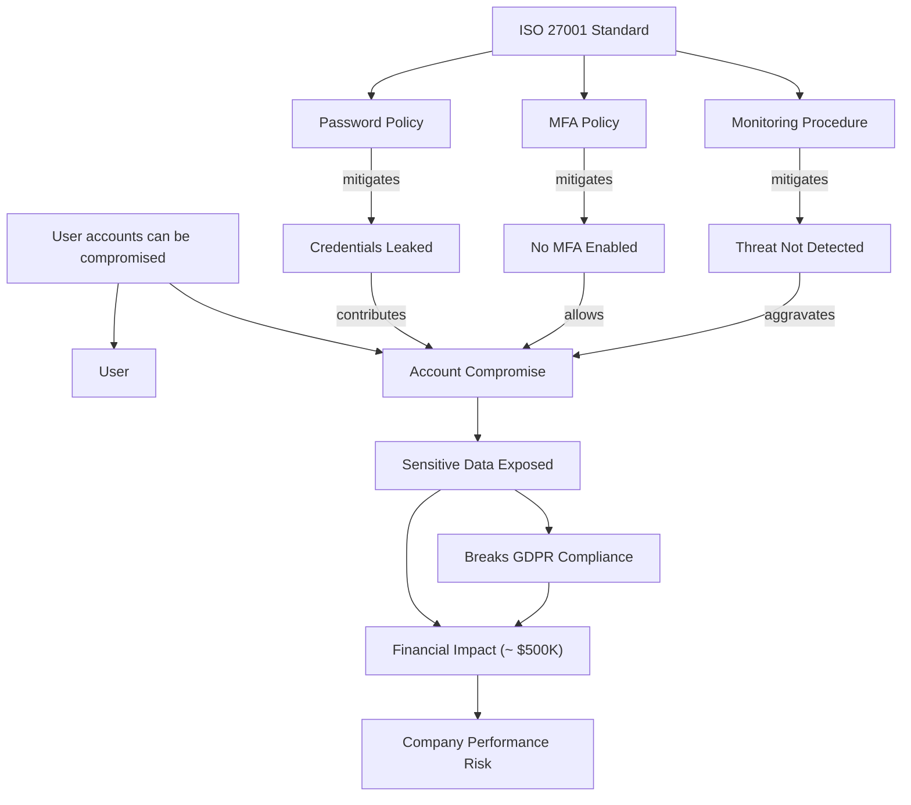

_by {{ authors | join(" and ") }}, {{ date }}_

{{ download_pdf(date, pdf_file) }} {{ linkedin_post(linkedin) }} {{back_button(back_link)}}


## Introduction

Graph thinkers – those who naturally conceptualize information as networks of nodes and relationships – are poised to benefit immensely from advances in generative AI. Traditional graph databases represent data as nodes and edges (with edges denoting relationships between nodes), enabling rich semantic queries. However, using a graph database typically requires technical setup, data modeling, and query languages like Cypher or SPARQL. What if graph thinkers with **no coding skills** could leverage AI to build and explore graphs on the fly, using natural language alone? This paper introduces the concept of using **Large Language Models (LLMs) as ephemeral graph databases** – harnessing an LLM’s ability to understand and manipulate structured information in a conversational context, without a persistent database.

In an *ephemeral graph database*, the knowledge graph is created dynamically and exists only for the duration of an AI session, serving as a temporary reasoning structure. The graph is **fresh and transient**, constructed at query-time to suit the user’s context. This is in contrast to persistent knowledge graphs that are pre-built and stored long-term. Recent research and tools show the power of dynamic knowledge graphs in AI reasoning. For example, the *Knowledge Graph of Thoughts (KGoT)* architecture dynamically builds a task-specific knowledge graph to help an AI agent solve complex problems more effectively. Our approach similarly creates a graph on-the-fly, but with a twist: **the LLM itself acts as the graph engine**, interpreting user instructions to create nodes, edges, and even perform queries or visualizations, all in natural language.

This white paper, co-authored by Dinis Cruz and ChatGPT, demonstrates *step-by-step* how an LLM can be used as a graph database in a practical scenario. We will walk through a real-world example in a **tutorial style** – modeling a cybersecurity risk management scenario – to showcase how a non-programmer “graph thinker” can create and query an ephemeral graph using only an LLM. Along the way, we discuss the principles, benefits, and limitations of this approach, and how it empowers users to reason about complex relationships without traditional database tools.

## LLMs as Ephemeral Graph Databases: The Concept

**What does it mean to use an LLM as a graph database?** In essence, we are asking the LLM to play the role of a database that *natively understands nodes and edges*. The LLM takes in natural language instructions (prompts) that describe data (entities and their connections) and returns structured representations or answers, effectively simulating the behavior of a graph database. The term **“ephemeral”** highlights that the graph only persists within the LLM’s conversational context – there is no external storage of the data structure. If the session ends or the context is cleared, the “database” resets. However, within a single continuous session, the LLM’s memory (its context window) serves as the storage for nodes and relationships that have been described.

Traditional databases have well-defined operations (often summarized as *ACID* properties – Atomicity, Consistency, Isolation, Durability) to reliably store and retrieve data. In our LLM-driven approach, we won’t get full ACID guarantees, but we will mimic the basic **CRUD** operations of a database in conversation: we can **Create** nodes and edges, **Read** (retrieve or query) data from the graph, **Update** (transform) parts of the graph, and even **Delete** nodes or relationships if needed – all via prompting the LLM. We treat the LLM as a **black box graph engine**: we feed it inputs (graph data or queries in natural language) and receive outputs (new graph information, query results, or visualizations). There is no specialized graph query language required; the “query language” is plain English augmented with a structured style that we define through instructions.

Several key principles underlie using LLMs in this way:

* **Natural Language Interface**: The user interacts with the graph through plain language instructions, which the LLM interprets. This lowers the barrier to entry, as no programming or query syntax is needed.
* **On-the-Fly Schema**: The graph’s schema (the types of nodes/edges) can be defined incrementally and flexibly in the conversation. The LLM can handle *implicit ontology* by understanding context. For example, if the user says “create a node called **User** (type: Persona)”, the LLM doesn’t need a pre-defined “Persona” type in a schema – it can infer it on the fly.
* **Contextual Memory**: As the conversation progresses and more graph data is added, the LLM “remembers” earlier instructions (up to its context limit). This means within one session, it can refer back to previously created nodes and edges. In effect, the LLM’s context acts as an in-memory graph store.
* **Transient Persistence**: Between user and AI turns, the state of the graph is maintained in the LLM’s hidden state. There is *no persistence outside the chat*. If needed, the user could periodically dump the graph state to a file via the LLM (for example, asking the LLM to output all nodes and edges in a list, which the user saves), but the workflow assumes ephemeral use unless explicitly saved.
* **Transformation and Reasoning**: Unlike a regular graph database which would require external tools for analysis or visualization, an LLM can directly generate new insights or formats from the graph. For example, it can create a summary of the graph, answer questions in natural language by traversing the relationships, or even produce a visualization (like generating code for a graph diagram). This leverage of the LLM’s generative and reasoning capabilities makes it a “smart” graph engine, not just a data store.

In the following sections, we put these principles into practice. We will build an example graph step by step, demonstrating how a user can instruct the LLM to populate and query the graph. Our example will focus on a **cybersecurity risk scenario**. This scenario is chosen for its richness: it involves technical entities (systems, vulnerabilities), human entities (users, owners), policies/controls, and cascading impacts – an ideal playground for graph thinking. As we progress from simple to more complex graph operations, we encourage you to imagine how similar techniques could apply to other domains (such as project planning, knowledge management, or storytelling) where relationships between entities are key.

Before diving in, it's worth noting that this approach aligns with a broader trend of *dynamic knowledge graph reasoning*. Others in the AI community have explored building **temporary graphs for on-demand reasoning**. For instance, one approach constructs a new knowledge graph at query time, using it as a thinking tool to derive answers, and then discards it – calling this *“ephemeral reasoning”*. Our use of an LLM as an ephemeral graph database taps into the same idea: instead of retrieving facts from a static knowledge base, we are **building a relevant knowledge graph on the fly** with the help of the LLM, and using it to reason about a problem in a transparent, structured way.

With the concept established, let’s move on to the hands-on example. In a workshop setting, you could follow these steps interactively with an LLM (such as ChatGPT or similar) to recreate the experience.

## Step-by-Step Tutorial: Building a Risk Management Graph with an LLM

*Scenario:* You are a risk manager in a cybersecurity context, and you want to model the relationships between a potential risk, its causes, its impacts, and the stakeholders involved. You will use an LLM to construct a graph representing this information, *as if* the LLM were a graph database you can query. We will start simple and gradually build a complex graph.

For clarity, we will show example user prompts (in **bold**) and the kind of LLM responses (in *italic*) one might get when following this process. Think of this as an interactive lab.

### Step 1: Initializing the Graph Engine

First, we need to instruct the LLM to behave like a graph database. This typically involves a prompt that sets the context. For example:

**User:** 

```
You are a graph database that I can interact with using natural language. 

I will give you commands to create nodes and edges representing a knowledge graph. 

You will maintain a list of all nodes and edges. 

Only respond with the updated state or confirmation. Let’s start with an empty graph.
```

By giving a prompt like the above, we prime the LLM to take on the role. The LLM might respond with a confirmation that the graph is initialized:

**LLM:** 

*"Graph initialized. No nodes or edges currently exist."*

Now we have a “blank slate” graph in the conversation. We can begin adding data to it.

### Step 2: Creating Nodes (Entities)

We will add our first piece of information: a cybersecurity risk statement. Suppose the risk we want to model is: **“User accounts can be compromised.”** This will be one of our primary nodes (let's call it a Risk node). We notice this statement has a couple of meaningful parts: the concept of *User* (a type of actor) and *Account Compromise* (an event or outcome). It would be useful to have those as separate nodes so we can link them and add further detail later.

Let's create three nodes:

1. The risk itself (as a text or issue node).
2. A node for the actor **User** (type: Persona).
3. A node for **Account Compromise** (type: Event or Outcome).

We instruct the LLM accordingly:

**User:** 

```
Create a node for the risk 'User accounts can be compromised'. 
Also create a node 'User' (type Persona) and a node 'Account Compromise' (type Event)
```

If the LLM follows correctly, it will acknowledge these nodes. For instance:

**LLM:** 
```
Nodes created: 
  (1) User accounts can be compromised  [Risk]
  (2) User  [Persona]
  (3) Account Compromise  [Event]
```

Now, if we ask the LLM to list all nodes, it should show those three:

**User:** *"List all current nodes."*

**LLM:**: 
```
  1. User accounts can be compromised; 
  2. User; 
  3. Account Compromise
```

At this stage, we have nodes but no relationships yet. It’s like having isolated points. The power of a graph comes from linking these nodes.

### Step 3: Establishing Basic Relationships

We will now create edges (links) between the nodes to reflect their relationships. From the risk statement, *“User accounts can be compromised”*, we can infer:

* The risk *impacts* a **User** (if accounts are compromised, users are affected).
* The risk is essentially about an **Account Compromise** event (that’s the negative outcome we fear).

So, we add two edges:

* **Risk** → **User** with relationship **“impacts”**.
* **Risk** → **Account Compromise** with relationship **“involves”** (or we might say **“is about”**, but we choose a verb phrase that makes sense in context).

We prompt the LLM to add these edges:

**User:**

```
Create an edge from 'User accounts can be compromised' to 'User' labeled 'impacts'. 

Also create an edge from 'User accounts can be compromised' to 
'Account Compromise' labeled 'involves'.
```

The LLM should update its internal representation and confirm:

**LLM:** 

```
"Edges created: 
  'User accounts can be compromised' --(impacts)--> 'User'; 
  'User accounts can be compromised' --(involves)--> 'Account Compromise'
```

Now our tiny graph has three nodes and two edges. We can ask for a summary:

**User:** *"Show me all nodes and their connections."*
**LLM:**

```
User accounts can be compromised (Risk)
  – impacts → User (Persona)
  – involves → Account Compromise (Event)
  
User – (no further connections)
Account Compromise – (no further connections)*"
```

*(The above is a textual representation; an LLM could also output this in a structured form or even a quick ASCII diagram.)*

Already, by treating the LLM as a graph engine, we’ve structured a basic risk statement into a graph format. In a conventional graph database, we would have to define these entities and relationships with database commands or code. Here it’s done conversationally.

### Step 4: Expanding the Graph – Adding Impacts and Consequences

Next, we enrich the graph by thinking through **impacts** of an account compromise. In risk management, a single technical risk often has multiple layers of consequences:

* If user accounts are compromised, one likely impact is that **sensitive data could be exposed**.
* Exposure of sensitive data (especially customer or personal data) often **breaks compliance** obligations (e.g., violating GDPR regulations).
* Both the data breach and compliance failure can lead to **financial impact** (fines, customer loss, etc.).

Let’s add nodes for each of these impacts:

* **Sensitive Data Exposed** (type: Impact)
* **GDPR Non-Compliance** (type: Compliance Impact) – we can label it as "Breaks GDPR Compliance".
* **Financial Loss** (type: Impact) – for specificity, we might say "Financial Impact – estimated  $500K" as the node name.

Now, we link these to reflect causality:

* **Account Compromise** → **Sensitive Data Exposed** (relationship: “leads to” or “results in”).
* **Sensitive Data Exposed** → **Breaks GDPR Compliance** (relationship: “causes” or “aggravates” compliance issue).
* **Sensitive Data Exposed** → **Financial Impact (~ $500K)** (relationship: “results in” financial cost).
* **Breaks GDPR Compliance** → **Financial Impact (~ $500K)** (relationship: “results in” as well, since regulatory fines contribute to financial loss).
* Finally, we might link **Financial Impact (~ $500K)** up to a broader business risk node like **“Impact on Company Performance”** or **“Strategic Risk”** at the executive level. This highlights that a technical risk can escalate to a business-level risk.

We provide these instructions to the LLM:

**User:** 
```
Add nodes:
    'Sensitive Data Exposed' (Impact). 
    'Breaks GDPR Compliance' (Compliance Impact). 
    'Financial Impact (~~ $500K)'. 
    'Company Performance Risk'. 

Now link them: 

    'Account Compromise'           --(leads to      )--> 'Sensitive Data Exposed'; 
    'Sensitive Data Exposed'       --(causes        )--> 'Breaks GDPR Compliance'; 
    'Sensitive Data Exposed'       --(results in    )--> 'Financial Impact (~~ $500K)'; 
    'Breaks GDPR Compliance'       --(results in    )--> 'Financial Impact (~~ $500K)';
     'Financial Impact (~~ $500K)' --(contributes to)--> 'Company Performance Risk'."
```

This is a lot to add in one go, and a good LLM will handle it stepwise. The LLM might respond with confirmation or a summary of new nodes/edges:

**LLM:** 

```
Nodes created: 
  Sensitive Data Exposed; 
  Breaks GDPR Compliance; 
  Financial Impact (~ $500K); Company Performance Risk.
  
Edges created:

* Account Compromise         --(leads to      )--> Sensitive Data Exposed
* Sensitive Data Exposed     --(causes        )--> Breaks GDPR Compliance
* Sensitive Data Exposed     --(results in    )--> Financial Impact (~ $500K)
* Breaks GDPR Compliance     --(results in    )--> Financial Impact (~ $500K)
* Financial Impact (~ $500K) --(contributes to)--> Company Performance Risk
```

Now our graph has grown significantly. Let’s interpret what we have constructed. Starting from the original risk node, one can traverse a chain of reasoning:

* “**User accounts can be compromised**” (Risk) **involves** → **Account Compromise** (the event).
* **Account Compromise** **leads to** → **Sensitive Data Exposed** (a direct impact).
* **Sensitive Data Exposed** **causes** → **Breaks GDPR Compliance** (a secondary impact, regulatory).
* **Sensitive Data Exposed** also **results in** → **Financial Impact (~ $500K)** (a quantifiable business impact).
* **Breaks GDPR Compliance** also **results in** → **Financial Impact (~ $500K)** (since fines or legal costs are financial).
* **Financial Impact (~ $500K)** **contributes to** → **Company Performance Risk** (a top-level risk that matters to the board, e.g., hitting revenue or reputation).

Through this graph, a *graph thinker* can see a clear lineage from a technical risk at the IT level all the way to the strategic risk at the business level. This is powerful for explaining **why cybersecurity issues matter** in business terms. In a typical risk register (often just a spreadsheet), these relationships are not so explicit. But our graph, created with minimal effort via the LLM, makes the dependency chain transparent.

We can ask the LLM to visualize or summarize this subgraph. One simple way is to request an ASCII-art tree or outline:

**User:** *"Show the risk 'User accounts can be compromised' and all downstream impacts as a hierarchy."*

**LLM:** 

```
User accounts can be compromised:

  → Account Compromise (event)
      → Sensitive Data Exposed (impact)
          → Breaks GDPR Compliance (compliance impact)
          → Financial Impact (~ $500K) (business impact)
              → Company Performance Risk (strategic risk)
```

*(In the above, indentation shows layers of consequence. Both “Breaks GDPR Compliance” and “Financial Impact” are shown under “Sensitive Data Exposed” as parallel results. “Financial Impact” then leads to “Company Performance Risk.”)*

At this point, we have primarily built out the **impact side** of the risk graph (what happens if the risk materializes). Next, we will build out the **cause and prevention side** – what could lead to the risk and what controls exist or fail.

### Step 5: Incorporating Causes and Preventive Controls

Understanding why a risk might materialize is as important as knowing its impact. For “User accounts can be compromised,” consider the typical causes:

1. **Credentials are compromised** – e.g., a user's password was leaked or guessed.
2. **No Multi-Factor Authentication (MFA)** – without a second factor, a leaked password is sufficient for an attacker to gain access.
3. **Security Monitoring Failure** – the compromise wasn’t quickly detected by security systems (like a Security Information and Event Management system, SIEM), allowing the attacker to persist.

These can be modeled as contributing factor nodes. We will create:

* **Credentials Leaked** (Cause)
* **MFA Not Enabled** (Cause)
* **Threat Not Detected** (Cause – representing monitoring failure)

We then link these to the core event **Account Compromise** as prerequisites or contributing factors. We might use a relationship like **“allows”** or **“contributes to”**:

* **Credentials Leaked** **contributes to** → **Account Compromise**.
* **MFA Not Enabled** **allows** → **Account Compromise**.
* **Threat Not Detected** **aggravates** → **Account Compromise** (meaning if detection fails, the compromise fully unfolds).

In reality, *all three* cause factors might need to happen (in combination) for a full breach scenario. We won’t delve into logic gates (AND/OR) here, but the graph implicitly shows that if any of these causes are mitigated, the risk is reduced.

Let’s add these causes via the LLM:

**User:** 
```
Add causes: 
create nodes 'Credentials Leaked' (Cause), 
             'No MFA Enabled' (Cause),
             'Threat Not Detected' (Cause). 

Link each to 'Account Compromise':

    'Credentials Leaked'  --(contributes to)--> 'Account Compromise'; 
    'No MFA Enabled'      --(allows        )--> 'Account Compromise'; 
    'Threat Not Detected' --(aggravates    )--> 'Account Compromise'
```

After confirming nodes and edges, our graph now also has the upstream side of the risk:

* **Credentials Leaked** → (contributes to) → **Account Compromise**
* **No MFA Enabled** → (allows) → **Account Compromise**
* **Threat Not Detected** → (aggravates) → **Account Compromise**

Now think of **controls** or **policies** that correspond to each cause:

* To prevent **credentials leaking**, we enforce a **Password Policy** (e.g., strong passwords, periodic rotation) and general user security training.
* To avoid lack of MFA, we have a **Multi-Factor Authentication Policy** requiring MFA on all accounts.
* To mitigate undetected breaches, we have a **Security Monitoring Policy** or **Incident Response Procedure** (ensuring the SIEM and team respond to suspicious logins).

We will add control nodes and link them as mitigating factors for each cause:

* Node **Password Policy** (or “Password Complexity Requirement”) – link **Password Policy** **mitigates** → **Credentials Leaked**.
* Node **MFA Policy** – link **MFA Policy** **mitigates** → **No MFA Enabled** (essentially, having a policy would prevent that cause).
* Node **Monitoring/IR Procedure** – link **Monitoring Procedure** **mitigates** → **Threat Not Detected**.

Furthermore, these policies often come from standards or frameworks. For instance, an organization might be adhering to **ISO 27001** or **NIST** standards, which have specific controls for passwords and MFA. We can represent a snippet of a standards hierarchy:

* Node **ISO 27001 Standard**.
* Under it, node **ISO Control 5.3.1 (Password Management)** (as an example) – link **ISO 27001 Standard** **has control** → **Password Policy**.
* Node **ISO Control 5.3.2 (MFA Requirement)** – link **ISO 27001 Standard** **has control** → **MFA Policy**.
* Similarly, link an appropriate control for monitoring if exists.

We might also add a high-level risk **“Non-compliance with security standards”**, which occurs if we fail to implement required controls. This could tie back into our compliance risk node or directly to **Company Performance Risk** (since failing audits has business impact too).

For brevity, let’s illustrate adding one standard and a couple of controls:

**User:** 

```
Create nodes:
    'Password Policy' (Control), 
    'MFA Policy' (Control), 
    'Security Monitoring Procedure' (Control). 
            
Link nodes:
    'Password Policy'               --(mitigates)--> 'Credentials Leaked'; 
    'MFA Policy'                    --(mitigates)--> 'No MFA Enabled'; 
    'Security Monitoring Procedure' --(mitigates)--> 'Threat Not Detected'. 
    
Now create node 'ISO 27001 Standard' and link it: 
    'ISO 27001 Standard' --(includes control)--> 'Password Policy'; 
    'ISO 27001 Standard' --(includes control)--> 'MFA Policy'; 
    'ISO 27001 Standard' --(includes control)--> 'Security Monitoring Procedure'
```

The LLM updates the graph accordingly. We won’t list every edge textually here, but conceptually, we’ve created a **cause-and-control subgraph** that mirrors the defense side of risk management. If we look at the whole picture now, **Account Compromise** sits in the middle:

* On its left (upstream) are causes (password leaked, no MFA, no detection) and their mitigations (policies).
* On its right (downstream) are impacts (data exposed, compliance broken, financial loss, etc.).
* At the very top, we have the broad standards or top risks that connect to our elements (like ISO standard, company-level risks).
* At the very bottom, we still have the human aspect to add – which we will do next.

This graph is now quite complex, but the LLM can handle it as long as it’s within its context memory. We may at this point ask for a summary or diagram to ensure everything is captured. For example, we could ask for a *mermaid* diagram (a popular text-based graph description that can be rendered visually):

**User:** *"Provide a mermaid diagram code for the entire graph."*

**LLM:**

*"Here is the mermaid code:"*

```
graph TD
    R["User accounts can be compromised"] --> U["User"]
    R --> E["Account Compromise"]
    E --> I1["Sensitive Data Exposed"]
    I1 --> C1["Breaks GDPR Compliance"]
    I1 --> B["Financial Impact (~ $500K)"]
    C1 --> B
    B --> TR["Company Performance Risk"]

    L["Credentials Leaked"] -- contributes --> E
    M["No MFA Enabled"] -- allows --> E
    D["Threat Not Detected"] -- aggravates --> E

    P["Password Policy"] -- mitigates --> L
    F["MFA Policy"] -- mitigates --> M
    X["Monitoring Procedure"] -- mitigates --> D

    S["ISO 27001 Standard"] --> P
    S --> F
    S --> X

```

*"Which looks like this"*



*(The above is an example of mermaid syntax that the LLM might produce. If rendered, it would show a full graph with nodes and directed edges as described.)*

Such a diagram code can be copy-pasted into a mermaid renderer to visualize the graph. In a live workshop, one could actually have the LLM render this to an image if the environment allows, but the text itself is a clear specification of the graph.

### Step 6: Adding Assets and Stakeholders

Thus far, our graph covers the abstract risk and controls. Now we ground it in the **real world context**: which systems and people are involved?

Imagine our organization has two systems relevant to this risk:

- An **HR System** – containing employee data (personnel records).
- A **Marketing System** – containing customer data for marketing campaigns.

Both systems have user accounts that could be compromised, but they may have different security postures:

- The HR System has strong password policies and *MFA enabled* (so it’s well protected against the risk).
- The Marketing System enforces strong passwords but has *no MFA* (a known gap).

Also, consider who “owns” these systems:

- The **HR System** is managed by the **HR team**; let's say the **HR Manager** is directly responsible.
- The **Marketing System** is managed by the **Marketing team**, with the **Marketing Manager** responsible.
- Those managers report to executives: e.g., the HR Manager to the **Chief People Officer (CPO)**, and the Marketing Manager to the **Chief Marketing Officer (CMO)**.
- Ultimately, the CPO and CMO are accountable for risks in their areas, and they in turn report to the CEO or the board.

We will add:

- Node **HR System** (Asset)
- Node **Marketing System** (Asset)
- Node **HR Manager** (Role)
- Node **Marketing Manager** (Role)
- Node **Chief People Officer** (Role)
- Node **Chief Marketing Officer** (Role)
- Perhaps nodes for specific individuals (e.g., “Alice – HR Manager”, “Bob – Marketing Manager”, etc.), but we can keep it role-level for now.

Now link assets to the controls they implement or lack:

- **HR System** **implements** → **Password Policy**  
- **HR System** **implements** → **MFA Policy**  
- **Marketing System** **implements** → **Password Policy**  
- **Marketing System** – **MFA Policy** (here we have a gap, so perhaps **Marketing System** **lacks** → **MFA Policy** or we simply omit that edge to imply non-compliance).

Also link assets to the risk event if applicable:

- Both **HR System** and **Marketing System** could be targets of the **Account Compromise** risk. We might indicate this with an edge like **"at risk of"**:
   - **HR System** **at risk of** → **Account Compromise**  
   - **Marketing System** **at risk of** → **Account Compromise**  
  However, since *Account Compromise* was more generic, we might interpret these as instances: e.g., “HR account compromise” vs “Marketing account compromise”. To keep it simple, we’ll just note that the risk applies to both.

Next, link roles to assets:

- **HR Manager** **owns** → **HR System**  
- **Marketing Manager** **owns** → **Marketing System**  

Link senior roles:

- **HR Manager** **reports to** → **Chief People Officer**  
- **Marketing Manager** **reports to** → **Chief Marketing Officer**  

We won’t go further up to CEO for now.

We instruct the LLM to add these:

**User:** 

```
Add asset nodes 'HR System' and 'Marketing System'. 

Add role nodes 'HR Manager', 'Marketing Manager', 'Chief People Officer', 'Chief Marketing Officer'. 

Link assets to controls and risk: 
    'HR System'         --(implements)--> 'Password Policy'; 
    'HR System'         --(implements)--> 'MFA Policy'; 
    'Marketing System'  --(implements)--> 'Password Policy';  
        (Note: Marketing System lacks MFA). 

Link assets to risk: 
    'HR System'        --(at risk of)--> 'Account Compromise'; 
    'Marketing System' --(at risk of)--> 'Account Compromise'. 

Link ownership: 

    'HR Manager'        --(owns)--> 'HR System'; 
    'Marketing Manager' --(owns)--> 'Marketing System'. 

Link reporting: 
    'HR Manager'        --(reports to)--> 'Chief People Officer'; 
    'Marketing Manager' --(reports to)--> 'Chief Marketing Officer'."
```

The LLM adds these nodes and edges. Now our graph connects technology to people:

- It’s evident that the **Marketing System** is in a riskier state (no MFA, thus the edge for MFA is missing or could be explicitly flagged as a negative relationship). 
- The **Chief Marketing Officer** ultimately has a system under them that is non-compliant with MFA policy, which could be a talking point in risk discussions.

This sets the stage for a scenario where an incident occurs. We have all the pieces: the risk, causes, controls, assets, and stakeholders. We can now simulate an incident and see how the graph helps us respond.

### Step 7: Simulating an Incident and Querying the Graph

**The Incident:** Let’s say a breach monitoring service alerts us that a large dump of usernames and passwords from our company has appeared on the internet. This is a **credential leak event**. We identify that among the leaked credentials, there are accounts belonging to users of both the HR System and the Marketing System. For example, five accounts from each system were found in the leak (10 accounts total).

We will add an **Incident node** to the graph:

- Node **Credential Leak June 2025** (Incident)

Link it to the assets it affects:

- **Credential Leak June 2025** **affects** → **HR System** (with detail “5 accounts compromised” perhaps as a property)
- **Credential Leak June 2025** **affects** → **Marketing System** (5 accounts)

Also link it to the risk or event:

- **Credential Leak June 2025** **triggers** → **Account Compromise** (since leaked credentials enable account takeover)

And possibly link it to a response:

- Node **Incident Response IR-2025-06** (just an ID for tracking) linked to the incident if needed, or we can treat the incident node as the event itself.

In practice, once this incident is in the graph, we can query the graph to answer critical questions:

- **Which system is at highest risk now?** The graph would show that the Marketing System has no MFA, so those leaked credentials can directly lead to compromise. The HR System, having MFA, is safer (unless MFA was somehow bypassed or the leak included MFA tokens which is unlikely in a password dump).
- **What are the potential impacts of this incident?** By traversing from the Marketing System node through the “at risk of → Account Compromise” path, and then following the impact chain, we can enumerate: sensitive customer data exposure, GDPR violation,  $500K financial impact, and ultimately a hit to company performance. The HR System side would similarly threaten employee data and maybe internal compliance, but if MFA holds, that risk might not materialize.
- **Who needs to be alerted?** We can traverse from the Marketing System node up the “owns” and “reports to” links to see the **Marketing Manager** and **CMO** are the stakeholders. For the HR system, the HR Manager and CPO are stakeholders.
- **What actions are required?** The graph shows which controls were missing – e.g., **MFA Policy** was not implemented on Marketing. That indicates one action: implement MFA immediately on that system (though too late to prevent this leak’s fallout, it will help future). The graph also shows that **Password Policy** was in place, but credentials still got leaked (maybe via phishing or reuse). This suggests an action to **reset passwords** for those accounts (since the password policy alone can’t prevent a leak if users fall for phishing).
- **Did monitoring fail?** We have a cause node “Threat Not Detected” mitigated by “Monitoring Procedure”. If our SIEM did not detect those accounts being used by an attacker (assuming they did use them before we found the leak), that cause may have come into play. So a question: *Did the security monitoring catch any logins for those accounts?* If not, it validates that *Threat Not Detected* occurred. That points to strengthening monitoring.
- **What’s the compliance status?** The graph can highlight that we are in violation of the ISO 27001 controls (MFA not applied to one system). So another action: review compliance and report this gap, possibly update risk register for non-compliance.

Let’s add the incident to the graph via LLM:

**User:** 
```
"Add incident node 'Credential Leak (June 2025)' and link it: 
    'Credential Leak (June 2025)' --(affects 5 accounts in)--> 'HR System';
    'Credential Leak (June 2025)' --(affects 5 accounts in)--> 'Marketing System';
    'Credential Leak (June 2025)' --(triggers             )--> 'Account Compromise'
```

After updating, we can interrogate the graph by asking the LLM questions in plain language, since the graph is now embedded in its context. For example:

- **User:** *"Which system is most at risk from the June 2025 credential leak?"*  
  **LLM:** *"The Marketing System is most at risk because it does not have MFA enabled. The leaked passwords can directly be used to access it, whereas the HR System requires MFA, adding an extra layer of protection."*

- **User:** *"What data could be exposed if the Marketing System is breached?"*  
  **LLM:** *"If the Marketing System is breached, sensitive customer data in that system could be exposed. According to our graph, that would result in sensitive data being exposed, potentially breaking GDPR compliance and leading to an estimated financial impact of  $500K, which in turn could affect company performance."* (The LLM is tracing the path: Marketing System → Account Compromise → Sensitive Data Exposed → GDPR Compliance & Financial Impact.)

- **User:** *"Who should be notified about this incident?"*  
  **LLM:** *"The Marketing Manager (owner of the Marketing System) and the Chief Marketing Officer (to whom the manager reports) should be notified, as they are responsible for the affected system. Similarly, the HR Manager and Chief People Officer should be informed about the HR System accounts, although that system has MFA which mitigates the risk."*

- **User:** *"List the immediate actions to take in response."*  
  **LLM:**

    1. ***Reset passwords** for all affected accounts in both HR and Marketing systems (to invalidate the leaked credentials).*  
    2. ***Enable MFA** on the Marketing System as soon as possible to prevent account compromise using just passwords.*  
    3. ***Investigate access logs** on the Marketing System for any suspicious logins or data access using those accounts (since the threat might not have been detected in real-time).*  
    4. **Increase monitoring** for both systems – ensure the security team and SIEM can detect and alert on unusual login activities for those accounts moving forward.*  
    5. ***Review compliance and controls** – document that Marketing System lacked MFA (non-compliance with policy/ISO standards) and address this gap, update the risk register accordingly."*

The above Q&A shows how the LLM can use the graph we built to generate useful outputs. It’s effectively performing graph queries under the hood by following the relationships we established, and then articulating the results in a human-friendly manner. This is a major advantage of using an LLM as the graph database: we can get *narrative answers* and *contextual recommendations*, not just data dumps.

Finally, the LLM could even produce a summary report of the whole scenario, combining everything:
- a description of the risk,
- which assets are affected,
- what the causes and impacts are,
- and what actions are needed. 

Such a report is essentially a traversal of the graph formatted as a report – something a human analyst would normally do manually by looking at various data sources.

## Benefits of the LLM-as-Graph Approach

Using LLMs as ephemeral graph databases offers several compelling benefits for graph thinkers and domain experts:

- **No-Code Knowledge Structuring:** As demonstrated, one can build a complex knowledge graph without writing a single line of traditional code or database query. The *natural language interface* allows subject matter experts to directly input their knowledge and see it structured as a graph. This lowers the barrier to working with graphs, inviting more people to utilize graph thinking in their work.

- **Flexibility and Speed:** Since the graph is built on the fly, the schema is flexible. You can introduce new types of nodes or relationships at any point as needed. The turnaround time from idea to graph update is just the time to write a prompt and get a response – usually seconds. This makes brainstorming and iteratively refining a model very fast. In a live workshop, participants could suggest new nodes or relations and see them added in real-time.

- **Integrated Reasoning:** The LLM doesn’t just store the graph; it can reason about it. We saw the model explain impacts and suggest actions by traversing the graph and applying logical reasoning. This is akin to having an analyst always available to analyze the graph's data. Traditional graph databases would require separate analytics or user interpretation, whereas the LLM can directly generate insights from the graph.

- **Automated Visualization:** With an LLM, users can ask for different representations of the graph – lists, hierarchies, or even diagram code (like Mermaid or DOT for GraphViz). This simplifies the process of creating visuals for presentations or reports. In our example, a single prompt yielded a Mermaid diagram of the entire graph structure.

- **Ephemeral = Safe for Experimentation:** The transient nature of the graph in an LLM session can be an advantage during early brainstorming or sensitive discussions. Nothing is permanently stored unless you choose to save it. If you are exploring a problem, you can spin up an ephemeral graph, test some hypotheses, and when done, the data vanishes (unless, of course, you are using an online service where conversation might be logged – one should consider the privacy aspect separately). The concept of *ephemeral reasoning* suggests that sometimes you only need the structure for the duration of solving a problem, and it can be discarded afterward to start fresh next time.

- **Enhanced Accessibility of Graph Concepts:** Many people struggle with formal graph query languages or even the concept of graphs if they have never used them. By embedding it in conversational AI, we make the power of graph databases accessible in a familiar Q&A or command-response paradigm. The LLM can even teach the user about graph concepts on the fly (“Here are your nodes...”, “That node isn’t linked yet, you might want to connect it to something related.”). It’s like having a graph database that is also a tutor and advisor.

However, it’s important to also understand the **limitations and considerations**:

- **Context Size Limits:** An LLM has a maximum context length (for example, many models handle a few thousand tokens of history). This means there is a practical limit to how large and detailed an ephemeral graph can get before the model starts forgetting earlier parts or becomes unable to pay attention to all nodes. Our scenario, while intricate, is still reasonably sized. If you attempted to encode a massive enterprise knowledge graph in one go, you might hit these limits. Techniques like summarizing parts of the graph or focusing on subgraphs at a time can help, but it's not the same as a truly persistent unlimited store.

- **Lack of True Persistence:** The ephemeral nature means you have to recreate or save the graph state if you want to reuse it later. There is no built-in persistence across sessions. In practice, one might periodically ask the LLM to output the entire graph in a structured format (JSON, CSV edges list, etc.) and save that externally if they want to reload it later by feeding it back in a prompt. This is a manual step that a real database handles automatically. Our approach trades off persistence for ease of use.

- **Reliability and Accuracy:** While LLMs are powerful, they can sometimes **hallucinate** or make errors, especially if instructions are ambiguous. For instance, the LLM might incorrectly link nodes if the prompt isn’t clear, or it might summarize the graph inaccurately if asked in a vague way. Rigorous verification is needed for critical use cases. In contrast, a true database would only contain exactly what was input. With an LLM, there's a slight risk it might introduce a relationship that wasn’t explicitly mentioned, just because it “thinks” it makes sense. Careful prompting (“only use the data provided”) can mitigate this.

- **No ACID Transactions:** Changes in the graph are not atomic or isolated – they are just messages in a conversation. If something goes wrong (e.g., the LLM misunderstands an instruction), there is no rollback except manually correcting via another prompt. Concurrent use is not applicable since it's a single user session typically. These are not deal-breakers for a single-user brainstorming scenario, but one should know this isn’t a robust multi-user database system with transactional integrity.

- **Performance:** For moderately sized graphs and short queries, an LLM is fast enough. But as the graph grows or queries become complex, each question to the LLM is essentially running a fresh reasoning process. It’s not indexing or caching results the way a database might optimize queries. Complex graph algorithms (like finding the shortest path, centrality measures, etc.) are not the LLM’s forte. It can do simple traversals because it “remembers” links, but it might struggle or be slow to perform, say, a graph diameter computation. This approach is best for conceptual, qualitative reasoning, not high-volume graph analytics.

- **Privacy and Security:** If using a cloud-based LLM (e.g., OpenAI’s ChatGPT), putting sensitive business risk data into it could be a concern. Always consider data confidentiality – either use an on-premise LLM or ensure you don’t include sensitive identifiers. In our example, we kept things generic (no actual names of employees or specific company info).

- **Combining with Real Data:** Our scenario was manually crafted. In a real situation, you might want to pull data from documents or systems (for instance, import a risk register or vulnerability scan results into the graph). LLMs can assist in information extraction (reading text and outputting triples of relationships), but doing that reliably might require careful prompt engineering or fine-tuning. There are hybrid approaches where an LLM can be used alongside a real graph database – for example, to translate natural language into graph queries or to summarize graph data. Our approach here stays “pure LLM” for simplicity, but one could envision tools that save the ephemeral graph to Neo4j or others for persistence, or conversely use an existing graph as input to an LLM.

Despite these challenges, the demonstration shows a tantalizing possibility: **empowering domain experts to directly build and query knowledge graphs through conversation.** By using LLMs in this way, graph thinking can become a more widespread practice, applied in daily decision making, incident response, strategic planning, and beyond.

## Conclusion

In the age of generative AI, we are witnessing new ways to interact with and organize knowledge. Using LLMs as ephemeral graph databases is one such innovation – it merges the structured clarity of graph models with the ease and intelligence of conversational AI. This approach effectively turns an LLM into a “graph brain” for the user, capable of not just remembering facts but also drawing connections and reasoning about them in context.

For **graph thinkers**, this is an empowering development. No longer constrained by needing technical tools or team support to set up a graph database, an individual can *think out loud* with an LLM and see their mental model take shape as a graph in real time. The white paper’s example walked through a cybersecurity risk scenario, but the template is general. Imagine using it to map out a medical diagnosis (symptoms→conditions→tests→treatments), a legal case (evidence→claims→laws→outcomes), or a novel’s plot and characters. The patterns of nodes and edges are everywhere, and an LLM can help weave them together.

In our example, **Dinis Cruz** provided the vision of empowering non-coders to harness graph thinking, and this collaboration with **ChatGPT Deep Research** has fleshed out how that vision can be implemented step-by-step. The result is a blueprint for a workshop or a self-guided exercise where anyone can try turning an LLM into their personal graph database for a while. 

Moving forward, we anticipate more synergy between LLMs and graph technologies:

- LLMs assisting in building and verifying knowledge graphs.
- Graphs providing factual grounding to LLMs (to reduce hallucinations).
- New interfaces that might allow visual editing of these AI-generated graphs, bridging the gap between ephemeral and persistent representations.

The key takeaway is that **structured thinking and natural language need not be at odds**. With the right prompts, an AI can be both a conversational partner and a structured data tool. Ephemeral graph databases via LLMs invite us to explore complex problems with the freedom to create, modify, and reason without upfront investment in software – the only requirement is our curiosity and clarity of thought (expressed in words).

As generative AI continues to evolve, those who think in graphs have a powerful ally at their disposal. By engaging with LLMs in this manner, we make our thinking visible and malleable. In doing so, we not only communicate with the machine, but also better explain to ourselves the intricate web of cause and effect, risk and reward, action and outcome that defines the problems we tackle. This, ultimately, is the promise of empowering the graph thinkers in the age of generative AI – turning ideas into interconnected knowledge, one prompt at a time.

**Sources:**

- Wikipedia – *Graph database*: definition of graph databases using nodes and edges:contentReference[oaicite:6]{index=6}.  
- GeeksforGeeks – *ACID Properties in DBMS*: explanation of ACID (Atomicity, Consistency, Isolation, Durability) for reliable transactions:contentReference[oaicite:7]{index=7}.  
- Besta et al., 2025 – *Knowledge Graph of Thoughts (KGoT)*: research on dynamically constructing knowledge graphs to enhance AI reasoning:contentReference[oaicite:8]{index=8}.  
- Gibson, 2025 – *Beyond Memory: Why Graphs Should Think, Not Just Retrieve*: discusses ephemeral, query-time graph construction for reasoning:contentReference[oaicite:9]{index=9}.

